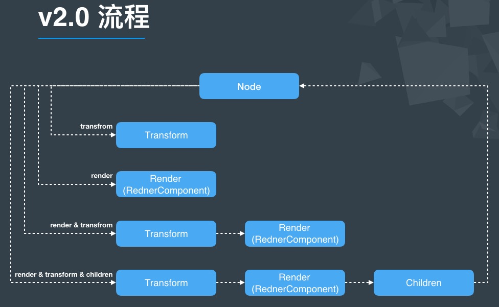
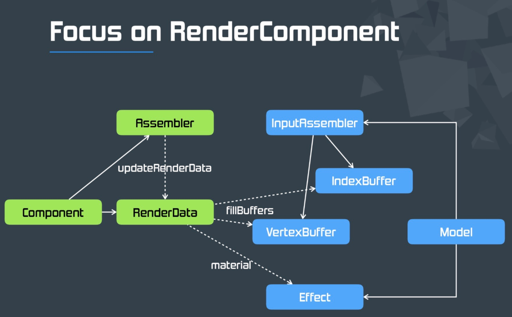

# **Learn Shader**

### Cocos Render Flow

### Cocos Shader

| 类型            | 说明                                                         |      |
| --------------- | ------------------------------------------------------------ | ---- |
| RenderData      | 渲染数据                                                     |      |
| Assemble        | 渲染数据装配器，修改顶点数据                                 |      |
| RenderComponent | 渲染组件，创建对应的assembler，控制assembler传参，让业务逻辑可以控制assembler |      |
| Effects         | shader程序                                                   |      |

### Cocos Matrix

cocos的_worldMatrix是个4×4的矩阵，代码中常用变量a、b、c、d、tx、ty、tz与矩阵对应信息如下图
$$
\left[\begin{matrix}
m00 & m04 & m08 & m12 \\
m01 & m05 & m09 & m13 \\
m02 & m06 & m10 & m14 \\
m03 & m07 & m11 & m15
\end{matrix}\right]
=>
\left[\begin{matrix}
a & c & 0 & tx \\
b & d & 0 & ty \\
0 & 0 & 1 & tz \\
0 & 0 & 0 & 1
\end{matrix}\right]
$$
1. worldMatrix是4×4的矩阵，储存节点位移、旋转、缩放、倾斜的信息。

2. 其中a、b、c、d包含旋转、缩放、倾斜的信息，tx,ty是位移信息。

3. _worldMatrix的更新实现在CCNode.js里，区分了2d和3d，之所以_worldMatrix是4×4的矩阵主要也是需要对齐3d，2d其实用3×3的矩阵就可以了。

4. 位移矩阵T(以2d举例)
   $$
   \left[\begin{matrix}
   x \\
   y \\
   1
   \end{matrix}\right]
   =
   \left[\begin{matrix}
   1 & 0 & \triangle x \\
   0 & 1 & \triangle y \\
   0 & 0 & 1
   \end{matrix}\right]
   \left[\begin{matrix}
   x_0 \\
   y_0 \\
   1
   \end{matrix}\right]
   \\
   x=x_0+\triangle x \\
   y=y_0+\triangle y \\
   x、y 是顶点的世界坐标；\\
   \triangle x、\triangle y 是锚点的世界坐标(位移)；\\
   x_0、y_0 是顶点的本地坐标。
   $$
   
5. 旋转矩阵R
   $$
   \left[\begin{matrix}
   x \\
   y \\
   1
   \end{matrix}\right]
   =
   \left[\begin{matrix}
   \cos\theta & -\sin\theta & 0 \\
   \sin\theta & \cos\theta & 0 \\
   0 & 0 & 1
   \end{matrix}\right]
   \left[\begin{matrix}
   x_0 \\
   y_0 \\
   1
   \end{matrix}\right] \\
   x_0=r\cos\alpha \\
   y_0=r\sin\alpha \\
   x=r\cos(\alpha+\theta)=r\cos\alpha\cos\theta-r\sin\alpha\sin\theta=x_0\cos\theta-y_0\sin\theta \\
   y=r\sin(\alpha+\theta)=r\sin\alpha\cos\theta+r\cos\alpha\sin\theta=y_0\cos\theta-x_0\sin\theta \\
   r是锚点于顶点的距离 \\
   \theta是逆时针旋转角度 \\
   \alpha是旋转角度为0时，锚点与x轴的逆时针角度
   $$

6. 缩放矩阵S
   $$
   \left[\begin{matrix}
   x \\
   y \\
   1
   \end{matrix}\right]
   =
   \left[\begin{matrix}
   k_1 & 0 & 0 \\
   0 & k_2 & 0 \\
   0 & 0 & 1
   \end{matrix}\right]
   \left[\begin{matrix}
   x_0 \\
   y_0 \\
   1
   \end{matrix}\right] \\
   x=k_1*x_0 \\
   y=k_2*y_0 \\
   k_1、k_2 分别是x、y轴上的缩放
   $$
   
7. 倾斜矩阵K
   $$
   \left[\begin{matrix}
   x \\
   y \\
   1
   \end{matrix}\right]
   =
   \left[\begin{matrix}
   1 & \tan\theta_x & 0 \\
   \tan\theta_y & 1 & 0 \\
   0 & 0 & 1
   \end{matrix}\right]
   \left[\begin{matrix}
   x_0 \\
   y_0 \\
   1
   \end{matrix}\right] \\
   x=x_0+y_0*\tan\theta_x \\
   y=y_0+x_0*\tan\theta_y \\
   \theta_x 是垂直的边顺时针倾斜角度 \\
   \theta_y 是水平的边逆时针倾斜角度
   $$

8. 矩阵相乘顺序
   $$
   世界矩阵(matrix)=位移(T)*旋转(R)*缩放(S)*倾斜(K) \\
   
   SK=S*K=
   \left[\begin{matrix}
   k_1 & 0 & 0 \\
   0 & k_2 & 0 \\
   0 & 0 & 1
   \end{matrix}\right]
   \left[\begin{matrix}
   1 & \tan\theta_x & 0 \\
   \tan\theta_y & 1 & 0 \\
   0 & 0 & 1
   \end{matrix}\right]
   =
   \left[\begin{matrix}
   k_1 & k_1\tan\theta_x & 0 \\
   k_2\tan\theta_y & k_2 & 0 \\
   0 & 0 & 1
   \end{matrix}\right] \\
   
   RSK=R*SK=
   \left[\begin{matrix}
   \cos\theta & -\sin\theta & 0 \\
   \sin\theta & \cos\theta & 0 \\
   0 & 0 & 1
   \end{matrix}\right]
   \left[\begin{matrix}
   k_1 & k_1\tan\theta_x & 0 \\
   k_2\tan\theta_y & k_2 & 0 \\
   0 & 0 & 1
   \end{matrix}\right]
   =
   \left[\begin{matrix}
   k_1\cos\theta-k_2\tan\theta_y\sin\theta & k_1\tan\theta_x\cos\theta-k_2\sin\theta & 0 \\
   k_1\sin\theta+k_2\tan\theta_y\cos\theta & k_1\tan\theta_x\sin\theta+k_2\cos\theta & 0 \\
   0 & 0 & 1
   \end{matrix}\right] \\
   
   matrix=T*RSK=
   \left[\begin{matrix}
   1 & 0 & \triangle x \\
   0 & 1 & \triangle y \\
   0 & 0 & 1
   \end{matrix}\right]
   \left[\begin{matrix}
   k_1\cos\theta-k_2\tan\theta_y\sin\theta & k_1\tan\theta_x\cos\theta-k_2\sin\theta & 0 \\
   k_1\sin\theta+k_2\tan\theta_y\cos\theta & k_1\tan\theta_x\sin\theta+k_2\cos\theta & 0 \\
   0 & 0 & 1
   \end{matrix}\right]
   =
   \left[\begin{matrix}
   k_1\cos\theta-k_2\tan\theta_y\sin\theta & k_1\tan\theta_x\cos\theta-k_2\sin\theta & \triangle x \\
   k_1\sin\theta+k_2\tan\theta_y\cos\theta & k_1\tan\theta_x\sin\theta+k_2\cos\theta & \triangle y \\
   0 & 0 & 1
   \end{matrix}\right] \\
   $$

   

### Cocos RenderData

### Cocos Assemble

### Cocos RenderComponent

### Cocos Effect

